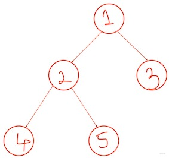

## Day07
--------
Problem name: Inorder Traversal (Iterative) <br>
Problem link: https://practice.geeksforgeeks.org/problems/inorder-traversal-iterative/0/
Read link: https://www.geeksforgeeks.org/tree-traversals-inorder-preorder-and-postorder/

## Question
-----------
 <br>
Inorder Traversal(left, root, right): It is a type of depth first traversal. At each node, left subtree is traversed first, then node is visited and then its right subtree is traversed. Inorder Traversal of the above tree is `4 2 5 1 3`. <br>
The question is to print Inorder traversal of given tree(without recursion i.e. iterative).

## Idea
-------


## Solution Approach 01
-----------------------
```
vector<int> inOrder(Node* root)
{
    //code here
    vector<int> ans;
    if(!root) return ans;
    stack<Node*> stk;
    Node* cur = root;
    while(1){
        while(cur){
            stk.push(cur);
            cur = cur->left;
        }
        if(stk.empty()) break;
        Node* temp = stk.top(); stk.pop();
        ans.push_back(temp->data);
        cur = temp->right;
    }
    return ans;
}
```

## Notes
--------

## Solution Approach 02
-----------------------
```
```

## Notes
--------

## Similar Problem 01
---------------------
Problem name: Preorder Traversal (Iterative) <br>
Problem link: https://practice.geeksforgeeks.org/problems/preorder-traversal-iterative/0/#

## Question
-----------
Preorder Traversal(root, left, right): It is a type of depth first traversal. At each node, node is visited, then left subtree is traversed first, and then its right subtree is traversed. Preorder Traversal of the above tree is `1 2 4 5 3`. <br>
The question is to print Preorder traversal of given tree(without recursion i.e. iterative).

## Idea
-------

## Solution Approach 01
-----------------------
```
vector<int> preOrder(Node* root)
{
    //code here
    vector<int> ans;
    if(!root) return ans;
    stack<Node *> stk;
    stk.push(root);
    while(!stk.empty()){
        Node *temp = stk.top(); stk.pop();
        ans.push_back(temp->data);
        if(temp->right) stk.push(temp->right);
        if(temp->left) stk.push(temp->left);
    }
    return ans;
}
```

## Notes
--------

## Similar Problem 02
---------------------
Problem name: Postorder Traversal (Iterative) <br>
Problem link: https://practice.geeksforgeeks.org/problems/postorder-traversal-iterative/0/#

## Question
-----------
Postorder Traversal(left, right, root): It is a type of depth first traversal. At each node, left subtree is traversed first, then its right subtree is traversed and then node is visited. Postorder Traversal of the above tree is `4 5 2 3 1`. <br>
The question is to print Postorder traversal of given tree(without recursion i.e. iterative).

## Idea
-------
Idea to get post order traversal of binary tree comes from observing reverse post order traversal of binary tree. Reverse post order traversal of binary tree resembles pre order traversal except the left and right child positions are reversed. So, in the pre order traversal algorithm instead of pushing right child into the stack first, left child is to be pushed first to obtain reverse post order traversal. Once that is obtained, reversing the traversal would result in post order traversal.

## Solution Approach 01
-----------------------
```
vector<int> postOrder(Node* node) {
    // code here
    vector<int> ans;
    if(!node) return ans;
    stack<Node *> stk;
    stk.push(node);
    while(!stk.empty()){
        Node *temp = stk.top(); stk.pop();
        ans.push_back(temp->data);
        if(temp->left) stk.push(temp->left);
        if(temp->right) stk.push(temp->right);
    }
    reverse(ans.begin(), ans.end());
    return ans;
}
```

## Notes
--------

## Similar Problem 03
---------------------
Problem name: Levelorder Traversal <br>
Problem link: https://practice.geeksforgeeks.org/problems/level-order-traversal/1

## Question
-----------
LevelOrder Traversal(left, right, root): It is only type of breadth first traversal. At each height level of tree, nodes are traversed from left to right. Levelorder Traversal of the above tree is `1 2 3 4 5`. <br>
The question is to print Levelorder traversal of given tree(recursion can be used, but to maintain uniformity in questions, the problem is attempted without using recursion i.e. iterative).

## Idea
-------

## Solution Approach 01
-----------------------
```
vector<int> levelOrder(Node* node)
{
    //Your code here
    vector<int> ans;
    if(!node) return ans;
    queue<Node *> q;
    q.push(node);
    while(!q.empty()){
        Node *temp = q.front(); q.pop();
        ans.push_back(temp->data);
        if(temp->left) q.push(temp->left);
        if(temp->right) q.push(temp->right);
    }
    return ans;
}
```

## Notes
--------
